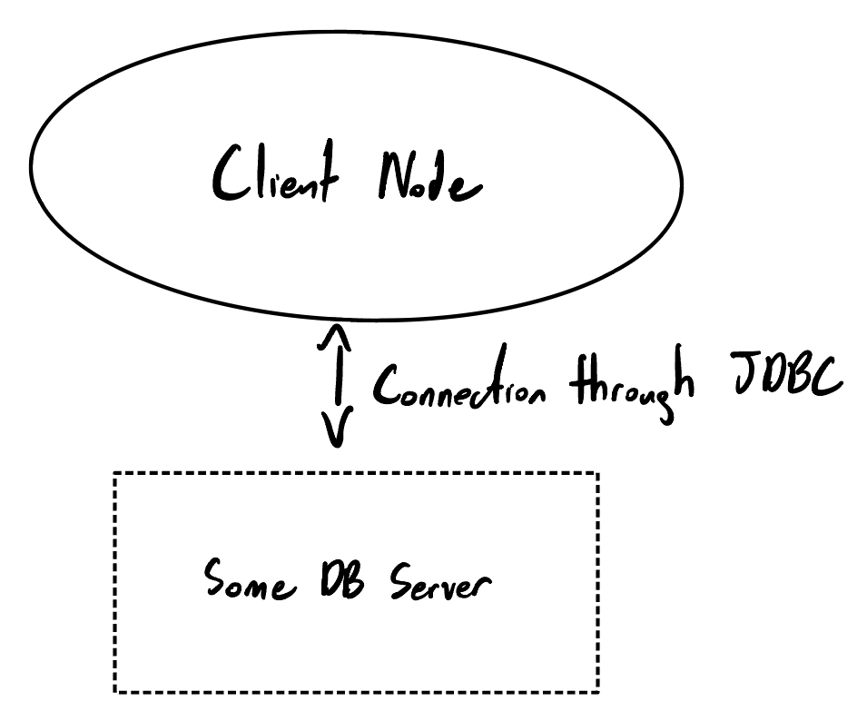
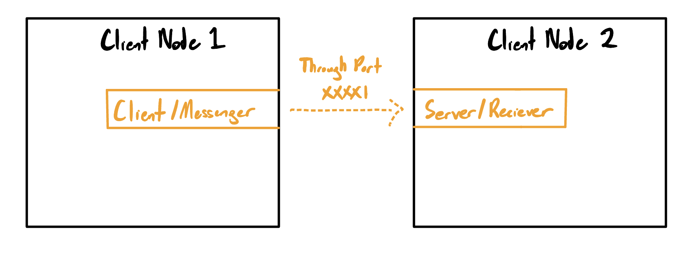
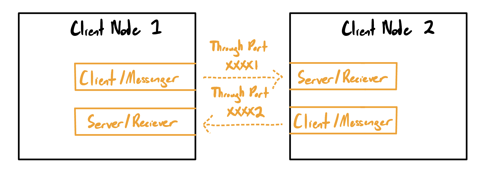
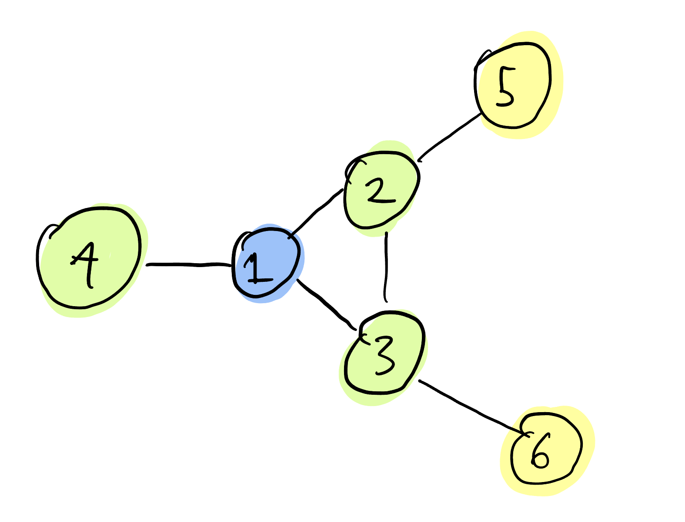
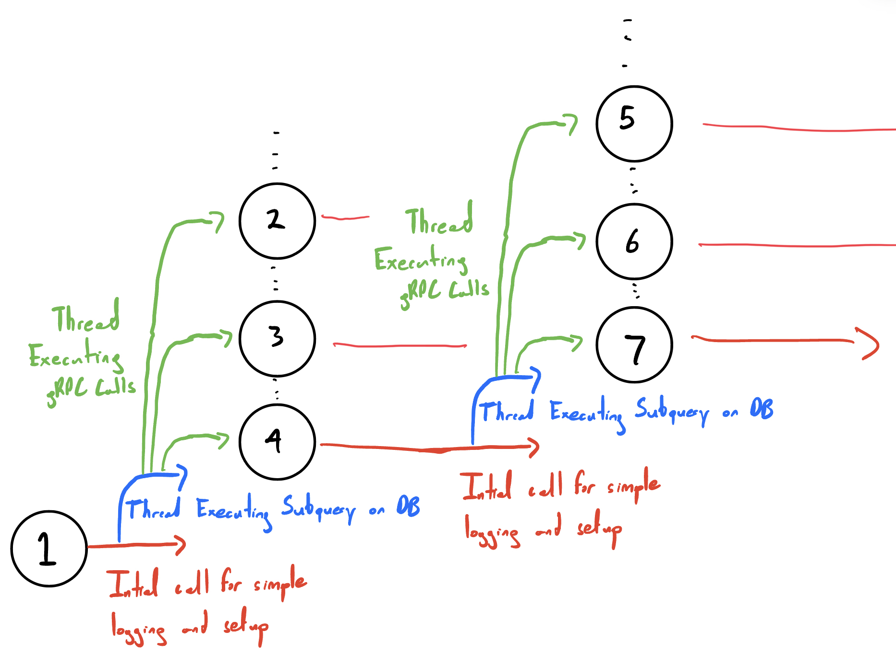
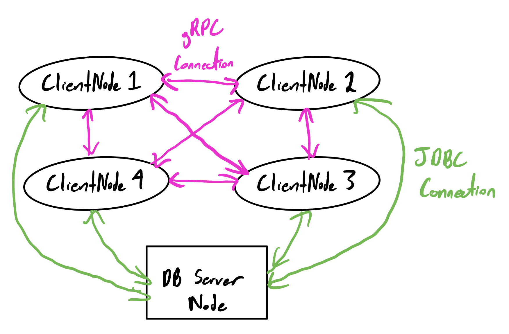
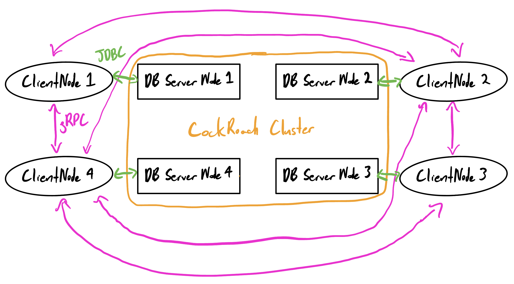

# Short Read Query Latency Benchmarking

## TODO:
* Implement Short Read [Query 3](http://ldbcouncil.org/ldbc_snb_docs/interactive-short-read-03.pdf)
* Implement Short Read [Query 5](http://ldbcouncil.org/ldbc_snb_docs/interactive-short-read-05.pdf)
* Implement Short Read [Query 6](http://ldbcouncil.org/ldbc_snb_docs/interactive-short-read-06.pdf)
* Implement Short Read [Query 7](http://ldbcouncil.org/ldbc_snb_docs/interactive-short-read-07.pdf)
* Setup LDBC SNB Database to connect to 
* Dockerize and Deploy the ClientNode program 

## About

This repsitory is an implementation of query execution in a distributed database system such as CockroachDB. Such databases already have query execution logic build in, however we wanted control/access of this logic. So one approach was to build our own query execution layer on top of CockroachDB. The purpose for this is to investigate on whether communication between nodes in a distributed database system is a significant bottlneck for query latencies.

## Project Structure

The basic buildings blocks for this implemenation are two classes: ```ClientNode``` and ```ClientNodeMap```

### ClientNode class

<div align="center">
    
</div>

The ClientNode class contains the following parameters:

```
ClientNode:
    url:            String
    db:             String
    driver:         String
    username:       String
    password:       String
    clientNodeMap:  ClientNodeMap
    recieverPort:   int
    id:             int

```

```url, db, driver, username, password ```  are for connecting to some database such as Cockroach or Postgres using the JDBC driver. 

```clientNodeMap``` stores a data structure ```ClientNodeMap```

```recieverPort``` is the port number for the ClientNode's gRPC Server

```id``` is simply a unique id number for an instance of a ClientNode

Example of initialization:

```java
ClientNode nodeOne = new ClientNode("jdbc:postgresql://localhost:26257/",
                                    "socialnetwork?sslmode=disable",
                                    "org.postgresql.Driver",
                                    "anish",
                                    "",
                                    clientNodeMap,
                                    50051,
                                    1);
```

### ClientNodeMap

The ```ClientNodeMap``` stores information that decribes the "mapping" of a cluster of ```ClientNode``` instances as well as other information needed to idenitify ClientNode instances because these instances will communicating to each other through gRPCs.

First, a ```ClientNodeMap``` needs to have which ```ClientNode``` instance (through its Id number) has which server port

#### Example:

```java
ArrayList<int[]> idPortPairs = new ArrayList<>();

int[] pair1 = { 1, 50051 };
int[] pair2 = { 2, 50052 };
int[] pair3 = { 3, 50053 };

idPortPairs.add(pair1);
idPortPairs.add(pair2);
idPortPairs.add(pair3);

ClientNodeMap clientNodeMap = new ClientNodeMap(idPortPairs);
```

Next, the ```ClientNodeMap``` needs to have edges that describe which ```ClientNode``` instances are connected to each other.

For example the following statement creates the following relationship between two ```ClientNode``` instances having Id numbers 1 and 2.

```java
clientNodeMap.addClientNodeConnection(1, 2);
```

<div align="center">
    
</div>

Where the ClientLocal/Messenger is a gRPC ```ManagedChannel``` instance and Server/Reciever is a gRPC ```Server``` instance.

Naturally add the following statement creates a bidirectional relationship between the two nodes.

```java
clientNodeMap.addClientNodeConnection(2, 1);
```

<div align="center">
    
</div>

We can continue to add ClientNode instances and edges to create more complicated maps/graphs such as this:

<div align="center">
    
</div>

Every node has a bidirectional relationship as described above with each of its neighbors. This is so that we can call the execution of a query from any ```ClientNode``` and it will have no problem eventually contacting the rest of the ```ClientNode``` instances in the map/graph to execute their respective subqueries.

## Query Execution Intuition

Although every query and its respective execution logic in this project will be hard coded, every query execution follows the same pattern of execution. Beginning from whichever node initially executes the query, parallel "Breath First Search" style execution will occur with every ClientNode executing their respective subquery.

<div align="center">
    
</div>

### Example Query

An example of simple query already implemented is ```SELECT * FROM socialnetwork.tmptable;``` where every ClientNode executes the subquery ```SELECT * FROM socialnetwork.tmptable WHERE serverId = X;``` where ```X``` is Id of the ```ClientNode```. Each ```ClientNode``` instance will intuitively share the same Id number with the Database Server Node it is connected to.

### serverId attribute

The purpose of the ```serverId``` attribute in the tables we are working with is to partition the data amongst different Database Server Nodes. Even though we may be able to achieve actual partitioning of the data using the premium features provided by CockroachDB or other DB services, we still want each ```ClientNode``` instance to retrieve the database rows located only in its respective Database Server Node, so the ```serverId``` attribute is added to ensure that.

## Toy/Development Setup

<div align="center">
    
</div>

In this toy setup, every ClientNode instance is connected to the same Database Server. This is just for simpicity when developing new queries. The single DB server serves as an abraction of a cluster of Database Servers. Here we don't care that all rows share the same physical loaction, we are just want to ensure that each query implementation correctly has each ```ClientNode``` instance only deal with Database rows that have the same ```serverId``` number as its own ```id ``` number.

To set up the database for this setup run: ```source DB_Setup/setup.sh```

## Experimentation Setup

<div align="center">
    
</div>

In this experimention setup, location of the database rows matter and the rows will be located in different physical locations. Every ```ClientNode```/Cockroach DB Server Node pair may located in a Local Area Network, or a Wide Area Network. We may load in our own toy databases, or a slightly modified version [LDBC SNB database](http://ldbcouncil.org/ldbc_snb_docs/schema.pdf). The vast majority of gRPC communication should take place between the ```ClientNode``` instances rather than between the CockroachDB Nodes. in the CockroachDB Cluster.

To set up the database for this setup run: ```TBD```

## How to run on Docker

To run the above experiment, follow these steps:

1. **Clone the Repository:** git pull the files from the branch.

2. **Install Docker Desktop (Recommended):** Highly recommend installing Docker Desktop, as it simplifies container management. If you don't use Docker Desktop, you'll have to manually connect to the Docker containers from the terminal to access logs and check if the experiment runs successfully.

3. **Make the Start Script Executable:** Run the following command in your terminal to make the start script executable:

    ```bash
    chmod +x multi-container-start.sh
    ```

4. **Run the Start Script:** Execute the start script with the following command:

    ```bash
    ./multi-container-start.sh
    ```

   This start script will set up the following:

    * Docker network called IndStudyNetwork.
    * Creation of a Docker image called "node image."
    * Startup of 6 Docker containers.
    * Note: It might take roughly 2 minutes for Gradle to set up within the containers.

5. **Check Docker Desktop:** Open Docker Desktop; you should see 6 running containers named server-1, server-2, ..., server-6.

6. **Inspect Container Logs:** Click on server-1 and check its logs. Once Gradle is set up, the execution begins at server-1.

7. **Ping Other Nodes:** server-1 should ping all other nodes to start up their gRPC server and client stubs.

8. **Experiment Countdown:** server-1 then waits for 2 minutes with a countdown done in logs before it begins the experiment.

9. **Verify Logs:** Once the experiment is done, check the logs of every Docker container to confirm if the setup has fired pings and database queries as expected.

10. **Shutdown Containers:** Once the experiment is done, server-1 container shuts down automatically, but you need to manually shut down the other 5 running Docker containers.

11. **Run the Shutdown Script:** In your terminal, run the following command to stop all running Docker containers, remove the containers, images, and networks established during the experiment:

    ```bash
    ./multi-container-shutdown.sh
    ```

These steps will help you run the Docker cluster setup experiment successfully.

## Running the Query-5 Experiment

To run the Query-5 experiment, follow these steps:

1. **Clone the Repository:** Clone or pull the repository to your local machine.

2. **Generate gRPC Files:** Run the `generateProto` task provided by Gradle to generate the necessary gRPC helper files.

3. **Update the Database:** Run the database setup script in `DB_Setup_Docker/setup.sh` to prepare your database.

4. **Make Start Script Executable:** Execute the following command to make the start script executable:

   ```bash
   chmod +x multi-container-start.sh
gradle 
5. **Start Docker Desktop:** Ensure that Docker Desktop is running on your system.

6. **Initiate the Experiment:** Start the experiment by running the following command:

   ```bash
   ./multi-container-start.sh

7. **Monitoring Progress:** The experiment will start running. You can monitor its progress by connecting to the logs of the "server-1" container. The experiment fetches output for messageId = 545, but you can modify this messageId in the docker-setup script. Make sure to use a messageId that exists in the database (refer to setup.sql to find a valid messageId).

8. **Cleanup:** Once the experiment is completed, run the following command to clean up all the Docker containers and temporary tables created by Query 5:

   ```bash
   ./multi-container-shutdown.sh

These steps will guide you through the process of running the experiment. Be sure to follow them in sequence for a successful execution.